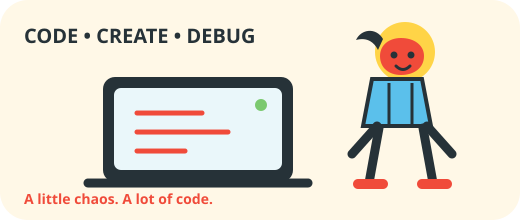

# Aryaman Tomar

### 🧑‍💻 B.Tech Computer Science Student

 

---

## 🧃 About Me

> **Hi, I'm Aryaman!**  
> A B.Tech Computer Science student who enjoys turning ideas into working software.

I like building things end-to-end — from backend logic to the interface people actually touch. Most days involve some mix of **Java, Python, JavaScript**, and whatever new tool I've decided to experiment with.

🎯 Currently:
- 🧠 Sharpening programming fundamentals
- 💻 Building projects with Java, Python & JavaScript
- 🧩 Practicing problems on LeetCode
- 🚀 Learning by building and breaking things

---

## 🛠️ My Tech Playground

<table>
<tr>
<td width="50%" valign="top">

### 💻 Languages

### 🎨 Frontend

</td>

<td width="50%" valign="top">

### ⚙️ Backend & Database

### 🔧 Dev Tools

</td>
</tr>
</table>

---

## 🎮 Featured Projects

<table>
<tr>
<td width="50%" valign="top">

### 🕹️ Project One

**Your project name here**

> One-line description of what it does.

`Java` `MySQL`

[💻 Code](#) · [🌐 Live Demo](#)

</td>

<td width="50%" valign="top">

### 🚀 Project Two

**Your project name here**

> One-line description of what it does.

`Python` `JavaScript`

[💻 Code](#) · [🌐 Live Demo](#)

</td>
</tr>
</table>

> 💡 Replace these two cards with your actual projects when you have the repo names and links ready.

---

## 📊 GitHub Stats

  

---

## 🧩 LeetCode

---

## 🌈 Let's Connect

 

### 「 Keep coding. Keep experimenting. 」

